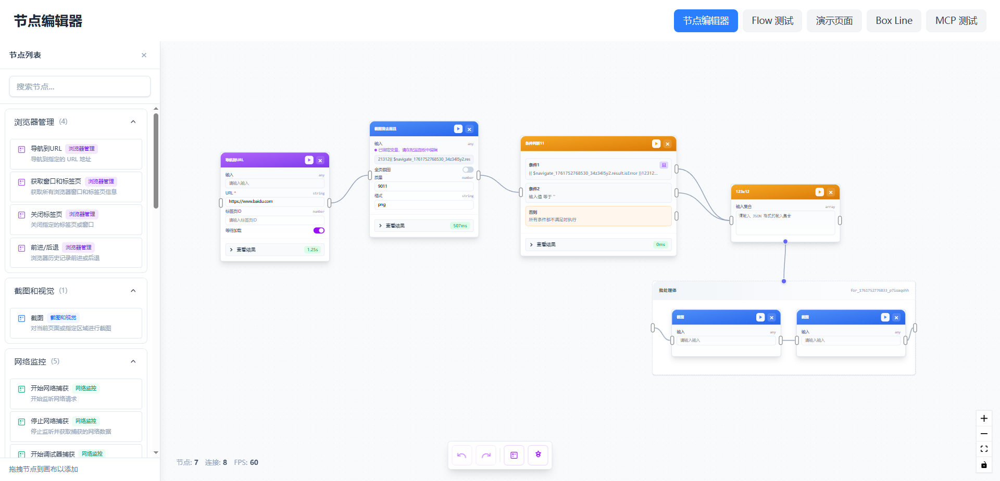
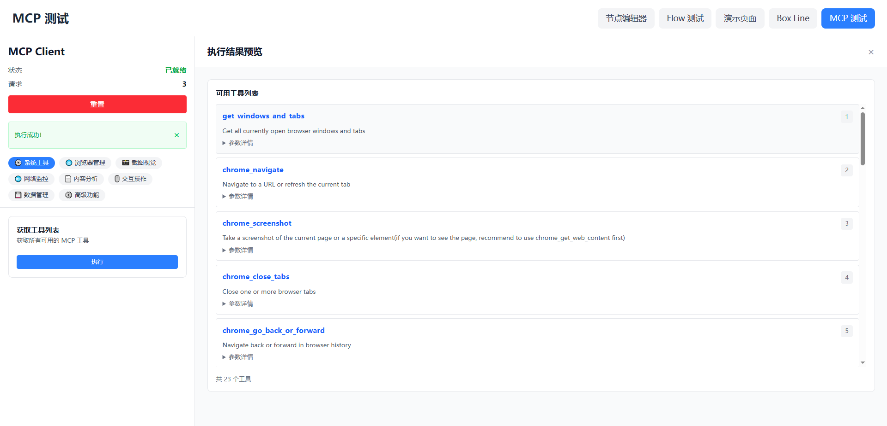
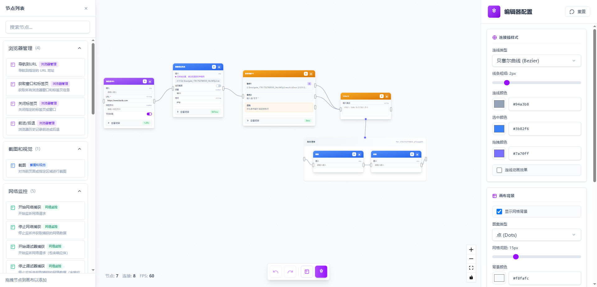
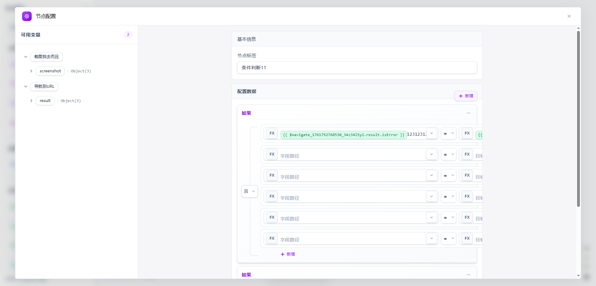

# 问题

我的节点设置了不可缓存，但是我希望在某一个节点位置设置开始，就不需要对前面的节点进行重新执行，前面的节点全部使用缓存数据

节点： 执行其他工作流 并且获取返回结果， base64 图片预览，
支持节点分组 (分组 = 函数)

# 已完成

OK 节点搜索支持拼音首字母 pinyin-pro
双击画布打开节点进行添加
粘贴节点 应该根据当前鼠标位置继续粘贴
for 循环节点失效
变量组件 无法正常输入问题，存在非常多的问题
拖拽变量的时候 按 ctrl 可以替换输入框中的文本为当前的变量（默认情况下是追加）这个有特殊的颜色

将 src\v2\cache-handler.js 替换成作为 http 请求的方式 这样就可以在浏览器中使用

## 优化

以后添加自定义节点渲染

# AI 浏览器工具 - 可视化自动化节点编辑器

<div align="center">
  
基于 Vue 3 + TypeScript + Vue Flow 构建的现代化浏览器自动化可视化编程平台

[](https://vuejs.org/)
[](https://www.typescriptlang.org/)
[](https://vitejs.dev/)
[](LICENSE)

</div>

---

**AI 浏览器工具** 是一个功能强大的可视化浏览器自动化编程平台，通过拖拽式节点编辑器，让用户无需编写复杂代码即可创建浏览器自动化流程。项目集成了 MCP（Model Context Protocol）协议，支持与浏览器进行深度交互。

## 📖 项目简介

### ✨ 核心特性

- 🎨 **可视化编程** - 直观的节点拖拽式编辑器，支持实时预览和调试
- 🔌 **MCP 协议集成** - 基于 Model Context Protocol，与浏览器插件深度集成
- 🧩 **丰富的节点库** - 30+ 内置节点，覆盖浏览器操作、数据处理、流程控制等
- 🔄 **流程控制** - 支持循环（For）、条件判断（If）等流程控制节点
- 📊 **变量系统** - 强大的变量管理和引用系统，支持跨节点数据传递
- 🎯 **实时执行** - 支持节点级别的单独执行和整体流程执行
- 💾 **历史记录** - 完整的撤销/重做功能（Ctrl+Z / Ctrl+Y）
- 🎨 **主题定制** - 可自定义连线样式、颜色、背景等编辑器外观

---

## 🖼️ 功能展示

### 节点编辑器主界面



_可视化节点编辑器，支持拖拽创建、连接节点，实时显示执行状态和结果_

---

### MCP 工具集成



_集成 MCP 协议，提供 23+ 浏览器操作工具，支持导航、截图、内容获取、交互等_

---

### 编辑器配置面板



_丰富的编辑器配置选项，支持自定义连线样式、颜色、网格背景等_

---

### 节点配置与变量管理



_强大的节点配置系统，支持变量管理、条件编辑器、参数配置等_

---

## 🚀 快速开始

### 环境要求

- Node.js >= 18
- pnpm >= 8

### 安装依赖

```bash
pnpm install
```

### 开发模式

```bash
# 启动开发服务器
pnpm dev
```

### 构建生产版本

```bash
pnpm build
```

### 预览生产构建

```bash
pnpm preview
```

---
## 🧩 微前端接入（嵌入 Vue2）

- 文档：`docs/micro-frontend-vue2-integration.md`
- 内容包含两条方案：
  - 方案 A（推荐）：使用 Qiankun 将本项目作为子应用嵌入 Vue2 基座（含完整生命周期与示例代码）。
  - 方案 B（轻量）：将组件封装为 Web Component，在 Vue2 中以自定义元素使用（适用于小部件场景）。

如需我直接将本仓库改造为 Qiankun 子应用或输出 Web Component 打包脚本，请告知你的偏好路径，我将按文档步骤落地并协助联调。

---

## 📦 技术栈

### 核心框架

- **Vue 3.5** - 渐进式 JavaScript 框架
- **TypeScript 5.9** - 类型安全的 JavaScript 超集
- **Vite 7.1** - 下一代前端构建工具

### UI 与交互

- **Vue Flow** - 可视化流程编辑器核心库
- **Tailwind CSS 4.1** - 原子化 CSS 框架
- **VueUse** - Vue 组合式 API 工具集

### 状态管理

- **Pinia** - 轻量级 Vue 状态管理库
- **Vue Router** - 官方路由管理器

### 工具库

- **lodash-es** - JavaScript 实用工具库

---

## 📁 项目结构

```
ai-browser-tools/
├── src/
│   ├── components/              # 组件目录
│   │   ├── common/              # 通用 UI 组件
│   │   │   ├── Button.vue       # 按钮组件
│   │   │   ├── InputText.vue    # 输入框组件
│   │   │   ├── Select.vue       # 下拉选择组件
│   │   │   └── JsonViewer.vue   # JSON 查看器
│   │   └── node-editor/         # 节点编辑器组件
│   │       ├── CustomNode.vue   # 自定义节点
│   │       ├── ConfigPanel.vue  # 配置面板
│   │       ├── NodeListPanel.vue # 节点列表面板
│   │       └── nodes/           # 节点类型组件
│   ├── core/                    # 核心逻辑
│   │   ├── mcp-client.ts        # MCP 客户端
│   │   └── nodes/               # 节点定义
│   │       ├── browser/         # 浏览器操作节点
│   │       ├── content/         # 内容获取节点
│   │       ├── interaction/     # 交互操作节点
│   │       ├── network/         # 网络监控节点
│   │       ├── data/            # 数据管理节点
│   │       ├── flow/            # 流程控制节点
│   │       ├── transform/       # 数据转换节点
│   │       └── advanced/        # 高级功能节点
│   ├── stores/                  # Pinia 状态管理
│   │   ├── nodeEditor.ts        # 节点编辑器状态
│   │   └── editorConfig.ts      # 编辑器配置状态
│   ├── config/                  # 配置文件
│   │   ├── editorConfig.ts      # 编辑器配置
│   │   ├── nodeTheme.ts         # 节点主题配置
│   │   └── nodeEditorLayout.ts  # 布局配置
│   ├── typings/                 # TypeScript 类型定义
│   ├── utils/                   # 工具函数
│   ├── views/                   # 页面组件
│   │   ├── NodeEditor.vue       # 节点编辑器页面
│   │   └── MCPTest.vue          # MCP 测试页面
│   └── main.ts                  # 应用入口
├── docs/                        # 详细文档
│   ├── tech-stack.md            # 技术栈说明
│   ├── project-structure.md     # 项目结构规范
│   ├── component-design.md      # 组件设计原则
│   ├── hooks-guide.md           # Hooks 使用指南
│   └── code-standards.md        # 代码规范
├── public/                      # 静态资源
├── images/                      # 项目截图
├── package.json                 # 项目配置
├── vite.config.ts              # Vite 配置
├── tsconfig.json               # TypeScript 配置
└── README.md                   # 项目说明文档
```

---

## 🎯 功能特性详解

### 1️⃣ 节点系统（30+ 节点）

#### 浏览器管理（4）

- **导航到 URL** - 打开指定网页或刷新当前页面
- **获取窗口和标签页** - 获取所有打开的浏览器窗口和标签页信息
- **关闭标签页** - 关闭指定的标签页
- **前进/后退** - 控制浏览器历史记录导航

#### 内容获取（3）

- **获取网页内容** - 提取页面的文本、HTML 或结构化内容
- **搜索标签页内容** - 在所有打开的标签页中搜索指定内容
- **获取可交互元素** - 获取页面中的按钮、输入框等交互元素

#### 交互操作（3）

- **点击元素** - 使用选择器点击页面元素
- **填充/选择** - 填写表单或选择下拉框选项
- **键盘操作** - 模拟键盘输入和快捷键

#### 截图功能（1）

- **截图** - 捕获整个页面或指定元素的截图

#### 网络监控（5）

- **开始网络捕获** - 开始监听网络请求
- **停止网络捕获** - 停止网络监听并获取结果
- **开始调试器** - 启动网络调试器
- **停止调试器** - 停止网络调试器
- **发送网络请求** - 发送 HTTP 请求

#### 数据管理（4）

- **搜索历史记录** - 查询浏览器历史记录
- **搜索书签** - 查询浏览器书签
- **添加书签** - 添加新书签
- **删除书签** - 删除指定书签

#### 高级功能（3）

- **注入脚本** - 向页面注入自定义 JavaScript 代码
- **发送命令到注入脚本** - 与注入的脚本通信
- **捕获控制台** - 监听页面控制台输出

#### 流程控制（2）

- **循环（For）** - 遍历数组或对象，重复执行子节点
- **条件判断（If）** - 根据条件执行不同的分支

#### 数据转换（2）

- **合并数据** - 合并多个数据源
- **代码执行** - 执行自定义 JavaScript 代码处理数据

---

### 2️⃣ 变量系统

- **全局变量管理** - 统一管理所有节点产生的变量
- **变量引用语法** - 使用 `{{ variable }}` 语法引用变量
- **嵌套访问** - 支持 `{{ user.name }}` 、`{{ list[0] }}` 等复杂路径
- **实时预览** - 在变量面板中实时查看变量值
- **类型支持** - 支持字符串、数字、对象、数组等多种数据类型

---

### 3️⃣ 编辑器功能

- **拖拽创建节点** - 从左侧节点列表拖拽到画布创建节点
- **节点连接** - 拖拽端口创建节点间的数据流连接
- **多选操作** - 支持框选多个节点进行批量操作
- **复制粘贴** - 快速复制节点和连接（开发中）
- **撤销重做** - 完整的历史记录管理（Ctrl+Z / Ctrl+Y）
- **网格对齐** - 可选的网格吸附功能
- **小地图** - 显示整体流程缩略图，快速定位
- **缩放平移** - 灵活的画布缩放和平移操作

---

### 4️⃣ MCP 协议集成

**什么是 MCP？**

MCP（Model Context Protocol）是一个标准化的协议，用于客户端与浏览器插件之间的通信。

**功能特性：**

- ✅ 自动会话管理（Session ID）
- ✅ 完整的类型支持（TypeScript）
- ✅ 错误处理和重试机制
- ✅ 详细的日志输出
- ✅ 单例模式支持

**使用示例：**

```typescript
import { createMCPClient } from "workflow-browser-nodes";

// 创建客户端
const client = createMCPClient();

// 初始化
await client.initialize();

// 调用工具
const result = await client.callTool("chrome_navigate", {
  url: "https://www.example.com",
});
```

详细文档请参考：[README-MCP.md](./README-MCP.md)

---

## 🎨 使用指南

### 创建第一个自动化流程

1. **打开节点编辑器**

   - 启动项目后，点击顶部导航栏的"节点编辑器"

2. **添加节点**

   - 点击左侧面板，展开"浏览器管理"分类
   - 将"导航到 URL"节点拖拽到画布

3. **配置节点**

   - 点击节点，在右侧配置面板中输入 URL
   - 例如：`https://www.baidu.com`

4. **添加更多节点**

   - 继续添加"获取网页内容"节点
   - 连接两个节点的端口

5. **执行流程**

   - 点击节点上的"播放"按钮执行单个节点
   - 或点击顶部工具栏的"运行全部"执行整个流程

6. **查看结果**
   - 节点下方会显示执行结果
   - 在变量面板中查看生成的变量

---

## 📚 详细文档

项目提供了完整的开发文档，位于 `docs/` 目录：

- 📘 [技术栈和初始化](./docs/tech-stack.md)
- 📗 [项目结构规范](./docs/project-structure.md)
- 📙 [组件设计原则](./docs/component-design.md)
- 📕 [Hooks 使用指南](./docs/hooks-guide.md)
- 📓 [配置文件管理](./docs/config-management.md)
- 📔 [代码规范](./docs/code-standards.md)
- 📖 [常用工具和方法](./docs/common-utilities.md)
- ✅ [开发检查清单](./docs/checklist.md)

---

## 🛠️ 开发计划

### ✅ 已完成

- [x] 基础节点编辑器功能
- [x] 30+ 浏览器操作节点
- [x] MCP 客户端集成
- [x] 节点配置面板
- [x] 变量系统基础功能
- [x] 历史记录（撤销/重做）
- [x] 编辑器配置面板
- [x] 流程控制节点（循环、条件判断）
- [x] 节点拖拽到循环容器功能
- [x] Ctrl 键从容器中移出节点功能

### 🚧 进行中

- [ ] **变量编辑器 UI 优化**

  - 当前变量编辑器 UI 布局较为简陋
  - 需要优化变量树的展示和交互
  - 计划添加变量值的内联编辑功能

- [ ] **流程控制节点测试**
  - For 循环节点功能已实现，但未经过充分测试
  - If 条件判断节点需要更多测试用例
  - 需要完善容器节点的子节点执行逻辑

### 📋 待开发

- [ ] 节点执行引擎优化
- [ ] 流程保存和加载功能
- [ ] 节点模板市场
- [ ] 错误处理和断点调试
- [ ] 节点复制粘贴功能
- [ ] 变量监控和断点
- [ ] 流程版本管理
- [ ] 导出为独立脚本
- [ ] 更多内置节点（文件操作、数据库等）
- [ ] 插件系统（支持自定义节点）

---

## 🤝 贡献指南

欢迎贡献代码、报告问题或提出建议！

### 开发流程

1. Fork 本仓库
2. 创建特性分支 (`git checkout -b feature/AmazingFeature`)
3. 提交更改 (`git commit -m 'feat: 添加某个功能'`)
4. 推送到分支 (`git push origin feature/AmazingFeature`)
5. 提交 Pull Request

### 提交规范

使用 [约定式提交](https://www.conventionalcommits.org/zh-hans/) 规范：

- `feat`: 新功能
- `fix`: 修复 Bug
- `docs`: 文档更新
- `style`: 代码格式调整
- `refactor`: 代码重构
- `perf`: 性能优化
- `test`: 测试相关
- `chore`: 构建/工具链更新

---

## 📄 开源协议

本项目基于 [MIT](LICENSE) 协议开源。

---

## 🙏 致谢

- [Vue.js](https://vuejs.org/) - 渐进式 JavaScript 框架
- [Vue Flow](https://vueflow.dev/) - 强大的流程图库
- [Vite](https://vitejs.dev/) - 极速的构建工具
- [Tailwind CSS](https://tailwindcss.com/) - 实用的 CSS 框架
- [VueUse](https://vueuse.org/) - Vue 组合式 API 工具集

---

## 📧 联系方式

如有问题或建议，请通过以下方式联系：

- 提交 [Issue](../../issues)
- 发起 [Discussion](../../discussions)

---

<div align="center">

**⭐ 如果这个项目对你有帮助，请给个星标支持一下！**

Made with ❤️ by AI Browser Tools Team

</div>
